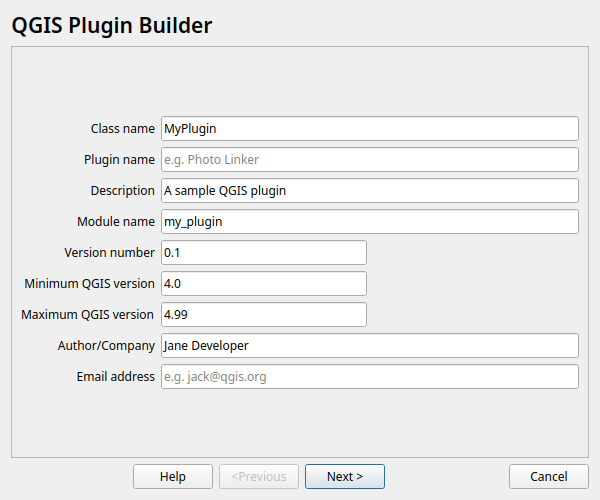

NOTE
====

**QGIS 4 development now takes place in master branch.**

QGIS Plugin Builder
===================

.. image:: https://github.com/jonah-sullivan/Qgis-Plugin-Builder/workflows/Tests/badge.svg
   :target: https://github.com/jonah-sullivan/Qgis-Plugin-Builder/actions

.. image:: https://img.shields.io/badge/License-GPL_v2-blue.svg
   :target: https://www.gnu.org/licenses/old-licenses/gpl-2.0.en.html

.. image:: https://img.shields.io/badge/QGIS-Plugin_Repository-brightgreen
   :target: https://plugins.qgis.org/plugins/plugin_builder/

This is a QGIS plugin that generates a QGIS plugin template for use in
creating custom plugins.

Documentation
-------------

See the `help`_ documentation about using the plugin.

.. _help: help/source/index.rst

Contributing
------------

New plugin templates can be added by creating a subdirectory below ``plugin_templates`` and registering the template in ``plugin_templates/__init__.py``
