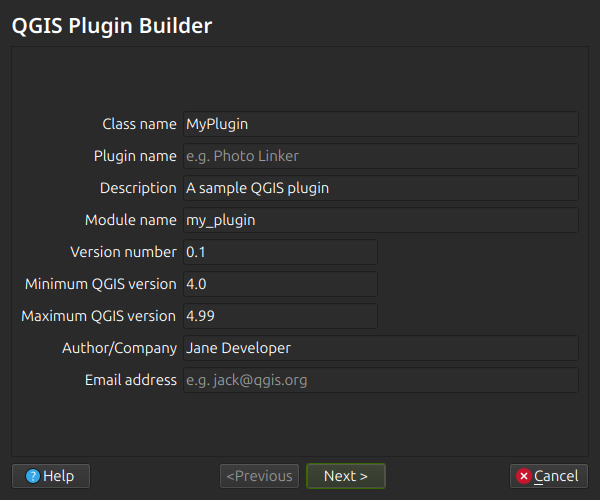

QGIS Plugin Builder
===================

.. note::

   **This branch (QGIS3) is in maintenance mode** — only critical bug fixes will be accepted.
   Active development has moved to the `QGIS4 branch`_, which supports QGIS 4 and Qt6.

   +-------------------+-------------------------------------------------------+
   | Branch            | Plugin repository                                     |
   +===================+=======================================================+
   | QGIS3 (this)      | https://plugins.qgis.org/plugins/pluginbuilder3       |
   +-------------------+-------------------------------------------------------+
   | QGIS4 (active)    | https://plugins.qgis.org/plugins/pluginbuilder4       |
   +-------------------+-------------------------------------------------------+

   If you are using QGIS 4, please install **Plugin Builder 4** from the QGIS plugin
   repository and open issues against the `QGIS4 branch`_.

.. _QGIS4 branch: https://github.com/jonah-sullivan/Qgis-Plugin-Builder/tree/QGIS4

.. image:: https://badges.gitter.im/Join%20Chat.svg
   :alt: Join the chat at https://gitter.im/g-sherman/Qgis-Plugin-Builder
   :target: https://gitter.im/g-sherman/Qgis-Plugin-Builder?utm_source=badge&utm_medium=badge&utm_campaign=pr-badge&utm_content=badge

This is a QGIS plugin that generates a QGIS plugin template for use in
creating custom plugins.

Documentation
-------------

See the `help`_ documentation about using the plugin.

.. _help: help/source/index.rst

Contributing
------------

New plugin templates can be added by creating a subdirectory below ``plugin_templates`` and registering the template in ``plugin_templates/__init__.py``
